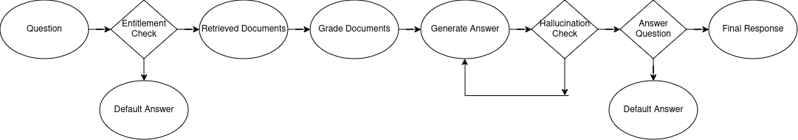

# SecureQuerySystem

This repository contains the source code and implementation details for a chatbot designed to answer questions from earnings reports. The chatbot employs a Retrieval-Augmented Generation (RAG) methodology and ensures access control based on user privileges for specific reports.

Watch the screen recording of the application's functionality [here](images/screen_recording.mp4).

## Solution Architecture

The chatbot solution is built using the following components:

### Backend API (FastAPI Microservice)

- Manages entitlement checks and RAG logic.
- Exposes endpoints for querying the chatbot.
- Provides APIs to upload documents and manage user access.

### WebUI (Streamlit App)

- Offers a user-friendly interface for interacting with the chatbot.
- Features a secure login system.
- Allows users to submit queries after logging in.

### LLM Model Server

- Hosts an embedding model via API using tools like Ollama. Used Kaggle GPU to host embedding model.
- Utilizes the Groq API for the Llama model.
- Processes user queries and generates answers based on contextual document retrieval.

---

## RAG Architectures

### Advanced RAG (CRAG + Adaptive RAG)

### Advanced RAG (CRAG + Adaptive RAG)

1. **Entitlement Check**: Ensures users can only access reports they are authorized to view.
2. **Document Retrieval and Filtering**: Retrieves relevant documents, applies metadata filters, and grades their relevance to the user query.
3. **LLM Integration**: Filters out irrelevant content and sends high-relevance documents to the LLM for query processing.
4. **Response Evaluation**: Validates the generated response for hallucinations and ensures alignment with the query.



---

## Steps to Run

### 1. Start the LLM Server

- Launch the LLM server on platforms like Google Colab or Kaggle GPU using `ollama_host.ipynb`.
- Save the LLM server URL for later use.

### 2. Download Required Models

- Set up necessary models (e.g., `nomic-embed-text`) on the LLM server.

### 3. Run the Backend API

- Start the FastAPI service with:
  ```bash
  uvicorn app:app --reload
  ```

### 4. Launch the Streamlit WebUI:\*\*

- Launch the Streamlit app with:
  ```bash
  streamlit run streamlit_app
  ```
- Open the Streamlit UI in a web browser.

### 5. Configure Streamlit UI:\*\*

- Log in with valid credentials.
- Begin querying the chatbot using the uploaded documents.

## To-Do List

### 1. Text ROI Detection

- Develop methods to handle infographics and noisy sections during document chunking.

### 2. Enhanced Document Chunking

- Investigate alternative text-splitting approaches, such as semantic or agentic chunking, for better context preservation.

### 3. RAG Flow Evaluation

- Use tools like `ragas` to measure context recall, precision, answer relevance, and faithfulness using ground truth data.

### 4. Enhanced Logging

- Introduce detailed logging at various stages for better monitoring and debugging.

### 5. Background Processing

- Implement background tasks for adding documents to the vector store to prevent timeouts with lengthy uploads.

### 6. Web UI Enhancements

- Implement functionality in the Web UI to allow adding documents and managing users.
